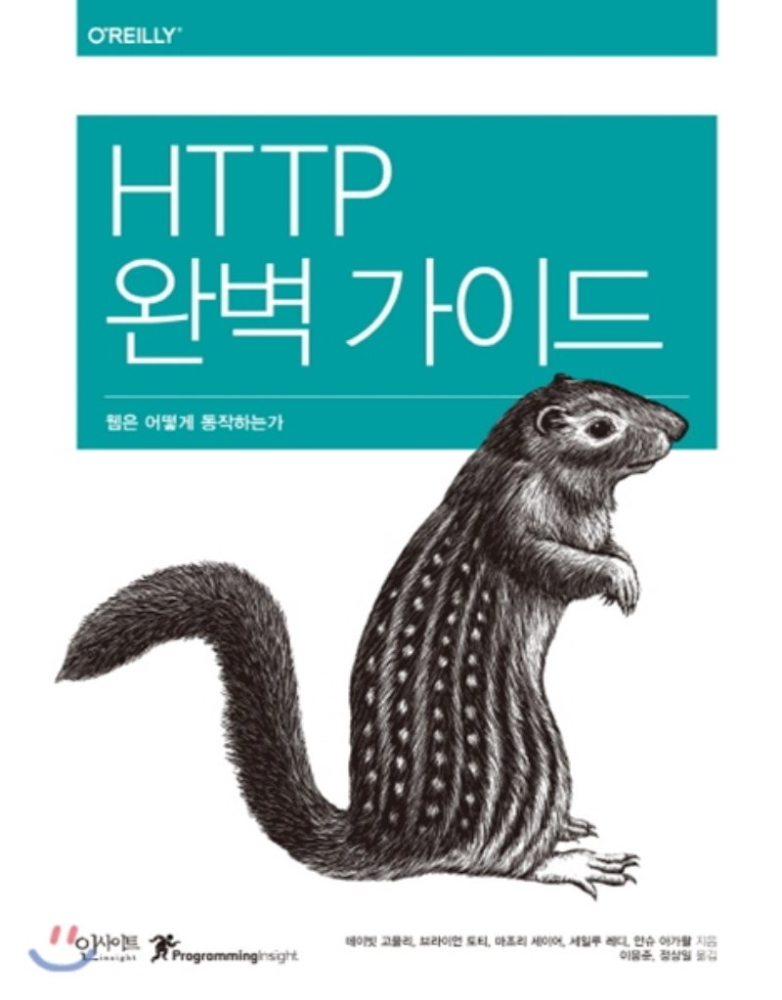

# HTTP 완벽가이드

네트워크에 대한 기본적인 이해를 하기 위한 저장소 ⬅️  

    

 

이 저장소는 [HTTP 완벽가이드](http://www.yes24.com/Product/Goods/15381085) 를 정리한 저장소입니다~!  
:book: 각 챕터별로 중요하다고 생각한 것을 정리했어요  
오타 지적은 늘 환영입니다:smile:  

## 목차

* 1장 [웹의 기초]([01]%20웹의%20기초/README.md)
* 2장 [URL과 리소스]([02]%20URL과%20리소스/README.md)
* 3장 [HTTP 메세지]([03]%20HTTP%20메세지/README.md)
* 4장 [커넥션 관리]([04]%20커넥션%20관리/README.md)
* 5장 [웹 서버]([05]%20웹%20서버/README.md)
* 6장 [Proxy]([06]%20Proxy/README.md)
* 7장 [Cache]([07]%20Cache/README.md)
* 10장 [HTTP/2.0]([10]%20HTTP%202.0/README.md)
* 11장 [클라이언트 식별과 쿠키]([11]%20클라이언트%20식별과%20쿠키/README.md)
* 12장 [기본 인증]([12]%20기본%20인증/README.md)
* 14장 [보안 HTTP]([14]%20보안%20HTTP/README.md)
* 17장 [협상과 트랜스코딩]([17]%20협상과%20트랜스코딩/README.md)
* 20장 [리다이렉션과 부하균형]([20]%20리다이렉션과%20부하균형/README.md)
* 부록C [HTTP 헤더]([부록C]%20HTTP%20헤더/README.md)
* 부록E [Base64]([부록E]%20Base64/README.md)

