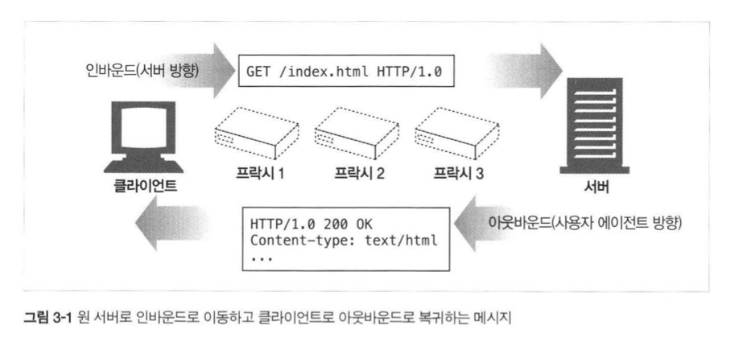

## HTTP 완벽가이드

### :three: 장 HTTP 메세지

#### 메세지의 흐름

메세지는 항상 인바운드에서 아웃바운드로 이동한다~! 

<div>
  
</div> 

#### 메세지의 각 부분

HTTP 메세지는 부분적으로 나뉘어져 있는데,  

```http
HTTP/1.0 200 OK // 시작줄
---------------------------
Content-type: text/plain // 헤더
Content-length: 10
---------------------------
Hi I'm a message! // 본문
```

전체적으로 시작줄은 **HTTP Protocol**과 **status**를 명시하고,  

헤더에는 본문에 담긴 **Content**의 종류와 길이. 

그리고 본문에는 내용을 명시하고 있다~!  

#### 메서드

HTTP를 요청하기 위해서는 `메서드` 라는 것이 존재하는데,  

| 메서드  | 설명                                                   | 메세지 본문이 있는가? |
| ------- | ------------------------------------------------------ | --------------------- |
| GET     | 서버에서 어떤 문서를 가져온다                          | 없음                  |
| HEAD    | 서버에서 어떤 문서에 대한 헤더만 가져온다              | 없음                  |
| POST    | 서버가 처리해야 할 데이터를 보낸다                     | 있음                  |
| PUT     | 서버에 요청 메세지의 본문을 저장한다                   | 있음                  |
| TRACE   | 메세지가 프락시를 거쳐 서버에 도달하는 과정을 추적한다 | 없음                  |
| OPTIONS | 서버가 어떤 메서드를 수행할 수 있는지 확인한다         | 없음                  |
| DELETE  | 서버에서 문서를 제거한다                               | 없음                  |

위 메서드중에서 **안전한 메서드**가 있는데. 

* GET: 서버에게 리소를 요청하기 위한 메서드
* HEAD: 정확하게 GET처럼 행동하지만, 본문은 없고 헤더만 반환한다

그 외로는

* PUT: 클라이언트가 요청의 본문을 들고 요청하는데, 요청 URL대로 **새 문서를 만들거나, 기존의 문서를 교체**하는데 사용한다
* POST: 클라이언트가 서버에 입력 데이터를 전송하기 위해서 사용한다
* TRACE: 주로 진단을 위해 사용되며, 요청한 요청이 어떠한 연쇄 요청/응답을 거쳐가는지 알 수 있다
* OPTIONS: 어떤 요청 메서드가 있는지 서버에게 질문하는 용도로 많이 쓴다
* DELETE: 서버에게 요청 URL을 삭제해달라고 하지만, **삭제가 수행되는 것을 보장하지 못한다**

추가로, 확장메서드라는 것이 있지만, 다음과 같은 규칙을 꼭 따른다!  

```
엄격하게 보내고, 관대하게 받아들여라
```

#### 상태코드

메서드는 **서버에게 무엇을 하라**고 말해주는 것처럼,  

상태코드는 서버가 클라이언트에게 무엇이 일어났는지 말해준다~!  

| 전체 범위 | 정의된 범위 | 분류            |
| --------- | ----------- | --------------- |
| 100 - 199 | 100 - 101   | 정보            |
| 200 - 299 | 200 - 206   | 성공            |
| 300 - 399 | 300 - 305   | 리다이렉션      |
| 400 - 499 | 400 - 415   | 클라이언트 에러 |
| 500 - 599 | 500 - 505   | 서버 에러       |

우선 주로 쓰이는 상태코드 :baggage_claim: 들이 있으니 한번 확인해보자. 

* `100` : **Continue**, 요청의 시작 부분 일부가 받아들여졌으며, Client는 나머지를 계속 보내야 한다

그 다음으로는 `성공상태코드`. 

* `200` : **Ok**, 요청은 정상이고 엔티티 본문은 리소스를 포함하고 있다
* `201` : **Created**, 서버 개체를 생성(PUT) 하라는 요청을 위한 것. 응답으로는 **구체적인 Location 헤더**와 함께, 그 **리소스를 참조할 수 있는 URL**을 엔티티 본문에 포함해야 한다. 서버가 반드시 생성한 후에 응답해야 한다.
* `202` : **Accepted**, 요청은 받아들여졌으나 서버는 아직 그에 대한 어떤 동작을 수행하지 않았다. 그래서, **응답 본문에 요청이 언제 완료될 것인지에 대한 추정과 그 정보**를 어디서 얻을 수 있는지 포함해야 한다.
* `203` : **Non-Authoritative Information**, 엔티티 헤더에 있는 정보가 원래 서버가 아닌 리소스의 사본에서 왔다는 응답
* `204` : **No Content**, 응답 메세지는 헤더와 상태줄을 포함하지만 Content는 표시하지 않는다. 주로 웹브라우저를 새 문서로 이동하지 않고 갱신할 때 사용
* `205` : **Reset Content**, 주로 브라우저를 위해 사용되는 또 하나의 코드, 브라우저에게 현재 페이지에 있는 HTML 폼을 지우라고 안내할 때 사용
* `206` : **Partial Content**, 부분 혹은 범위 요청이 성공했다. 이 응답은 반드시 Content-Range와 Date 헤더를 반드시 포함하고, Content-Location도 포함해야 한다

그 다음으로는 `리다이렉션 코드`,

* `300` : **Multiple Choices**, Client가 동시에 여러 리소스를 가르키는 URL을 요청한 경우, 리소스 목록을 같이 반환한다.
* `301` : **Moved Permantely**, 요청한 URL이 옮겨졌을 때 사용한다. 응답은 **Location 헤더에 현재 리소스가 존재하는 URL을 포함**해야 한다. 
* `302` : **Found**, 301 상태코드와 같지만 Location 헤더로 주어진 URL을 Client가 임시로 사용해야 한다
* `303` : **See Other**, Client에게 리소스를 다른 URL에서 가져와야 한다고 말해주고자 할 때 쓰인다.  URL을 응답 메세지에 Location 헤더로 명시해야 한다
* `304` : **Not Modified**, Client는 헤더를 이용해서 조건부 요청을 만들 수 있다
* `305` : **Use proxy**, 리소스가 반드시 proxy를 통해서 접근되어야 함을 알린다. **Location 헤더에 마찬가지로 URL을 명시**해야 한다

그 다음으로는 `클라이언트 에러 상태 코드`,

* `400` : **Bad Request**, 클라이언트가 잘못된 요청을 보냈다
* `401` : **Unauthorized**, 리소스를 얻기 전에 클라이언트가 인증해야 한다를 알리는 코드.
* `402` : **Payment Required**, 현재 사용되지 않지만 미래를 위해 남겨둔 코드
* `403` : **Forbidden**, 요청이 서버에 의해서 거부되었음을 알리는 코드. 거절의 이유는 응답 본문에 숨기기 위해 사용한다
* `404` : **Not Found**, 서버가 요청한 URL을 찾을 수 없음을 알리기 위한 코드
* `405` : **Method Not Allowed**, 요청한 URL에 대하여 지원하지 않는 메서드로 요청받았을 때 사용한다
* `406` : **Not Acceptable**, 주어진 URL에 대한 리소스 중 클라이언트가 받아들일 수 있는 것이 없는 경우 사용한다
* `407` : **Proxy Authentication Required**, 401 상태 코드와 같으나 리소스에 대한 인증을 Proxy 서버로 요청하라는 의미
* `408` : **Request Timeout**, 클라이언트의 요청을 완수하기에 너무나 많은 시간이 걸리는 경우
* `409` : **Request Conflict**, 요청이 리소스에 대해 일으킬 수 있는 충돌을 지정하기 위해 사용. 서버는 충돌에 대해 염려하는 부분을 본문에 작성해야 함
* `410` : **Gone**, 404와 비슷하나 서버가 한때 리소스를 가지고 있었다 라는 점이 다름.
* `411` : **Length Required**, 서버가 요청 메세지에 대하여 **Content-Length**를 명시해달라는 용도로 사용
* `412` : **Precondition Failed**, 클라이언트가 조건부 요청을 했는데, 그 중 하나가 실패했을 때 사용. 조건부 요청은 Except 헤더를 포함한 경우를 의미한다
* `413` : **Request Entity Too Large**, 서버가 처리할 수 있는 혹은 처리하고자 하는 한계를 넘은 크기의 요청을 클라이언트가 보냈을 때 사용
* `414` : **Request URI Too Long**, 서버가 처리할 수 있는 혹은 처리하고자 하는 한계를 넘은 길이의 URL을 보낸 경우 사용
* `415` : **Unsupported Media Type**, 서버가 이해하거나 지원하지 못하는 내용 유형의 엔티티를 클라이언트가 보냈을 때 사용
* `416` : **Required Range Not Satisfiable**, 요청 메세지가 리소스의 특정 범위를 요청했는데, 그 범위가 맞지 않을 때 사용
* `417` : **Exception Failed**, 요청에 포함된 Except 헤더에 서버가 만족시킬 수 있는 기대가 없는 경우 사용

그 다음으로는 `서버 에러 상태 코드` ,

* `500` : Internal Server Error, 서버가 요청을 처리할 수 없게 만드는 에러를 만났을 때 사용
* `501` : Not Implemented, 클라이언트가 서버의 능력을 넘은 요청을 했을 때 사용
* `502` : Bad Gateway, 프락시나 게이트웨이처럼 연결고리에 있는 응답 연쇄에 가짜 응답을 받았을 때 사용
* `503` : Service Unavailable, 현재 서버가 요청을 처리할 수 없지만 나중에는 가능함을 의미함. 응답 본문에 **Retry-After 헤더를 포함**해야 함
* `504` : Gateway Timeout, 상태 코드는 408과 비슷하지만 타임아웃이 Gateway나 Proxy에서 발생
* `505` : HTTP Version Not Supported, 서버가 지원할 수 없는 Protocol임을 의미할 때 사용

### 헤더

응답 코드에서 마찬가지로 응답 헤더 :headphones: 도 매우 매우 중요하다!!  

* 일반 헤더

| 헤더              | 설명                                                         |
| ----------------- | ------------------------------------------------------------ |
| Connection        | 클라이언트와 서버가 요청/응답 연결에 대한 옵션을 정할 수 있게 해준다 |
| Date              | 메세지가 언제 만들어졌는지에 대한 시간                       |
| MIME-Version      | 발송자가 사용한 MIME의 버젼을 알려준다                       |
| Transfer-Encoding | 수신자에게 안전한 전송을 위해 어떠한 인코딩이 적용되었는지 알려준다 |
| Upgrade           | 발송자가 업그레이드 하길 원하는 프로토콜 버젼                |
| Cache-Control     | 메세지와 함께 캐시 지지자를 전달하기 위해 사용               |

* 요청 헤더

| 헤더       | 설명                                                |
| ---------- | --------------------------------------------------- |
| Client-IP  | 클라이언트가 실행된 컴퓨터의 IP 주소                |
| Host       | 요청의 대상이 되는 서버의 호스트 명과 포트          |
| User-Agent | 요청을 보낸 어플리케이션의 이름을 서버에게 알려준다 |
| Referer    | 현재의 요청 URI가 들어있었던 문서의 URL을 제공한다  |

* Accept 관련 헤더

| 헤더             | 설명                                                  |
| ---------------- | ----------------------------------------------------- |
| Accept           | 서버에게 서버가 보내도 되는 미디어 종류를 알려준다    |
| Accept-Charset   | 서버에게 서버가 보내도 되는 문자집합을 알려준다       |
| Accept-Encoding  | 서버에게 서버가 보내도 되는 인코딩을 말해준다         |
| Accept-Language  | 서버에게 서버가 보내도 되는 언어를 말해준다           |
| Tranfer-Encoding | 서버에게 서버가 보내도 되는 확장 전송 코딩을 말해준다 |

* 조건부 요청 헤더

| 헤더   | 설명                                                         |
| ------ | ------------------------------------------------------------ |
| Except | 클라이언트가 요청에 필요한 서버의 행동을 열거할 수 있게 해준다 |
| Range  | 서버가 범위 요청을 지원한다면, 리소스에 대한 특정 범위를 요청한다 |

* 요청 보안 헤더

| 헤더          | 설명                                                         |
| ------------- | ------------------------------------------------------------ |
| Authorization | 클라이언트가 서버에게 제공하는 인증 그 자체에 대한 정보를 담고 있다 |
| Cookie        | 클라이언트가 서버에게 토큰을 전달할 때 사용한다              |
| Cookie2       | 요청자가 지원하는 쿠키의 버젼을 알려줄 때 사용한다           |

* 응답 헤더

| 헤더        | 설명                                                         |
| ----------- | ------------------------------------------------------------ |
| Age         | 응답이 얼마나 오래되었는지                                   |
| Public      | 서버가 특정 리소스에 대해 지원하는 요청 메서드의 목록        |
| Retry-After | 현재 리소스가 사용 불가능한 상태일 때, 언제 가능한지 알려주는 날짜 혹은 시간 |
| Server      | 서버 애플리케이션에 대한 이름과 버젼                         |
| Vary        | 서버가 확인해 보아야하고 그렇기 때문에 응답에 영향을 줄 수 있는 헤더들의 목록 |

* 엔티티 헤더

| 헤더             | 설명                                                         |
| ---------------- | ------------------------------------------------------------ |
| Allow            | 이 엔티티에 대하여 수행할 수 있는 요청 메서드들              |
| Location         | 클라이언트에게 해당 엔티티가 실제로 어디있는지 알려주는 헤더 |
| Content-Encoding | 본문에 적용된 인코딩                                         |
| Content-Length   | 본문의 길이나 크기                                           |
| Content-Location | 리소스가 실제 어디에 위치하는지                              |
| Content-Range    | 전체 리소스에서 이 엔티티가 해당하는 범위를 바이트 단위로 표현 |
| Content-Type     | 이 본문이 어떤 종류의 객체인지                               |
| Expires          | 이 엔티티가 유효하지 않을 때 원본을 다시 받아와야 하는 일시  |

