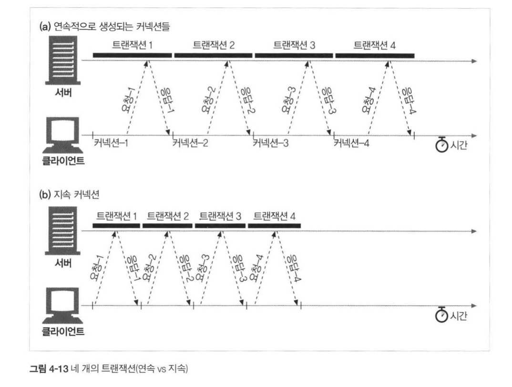
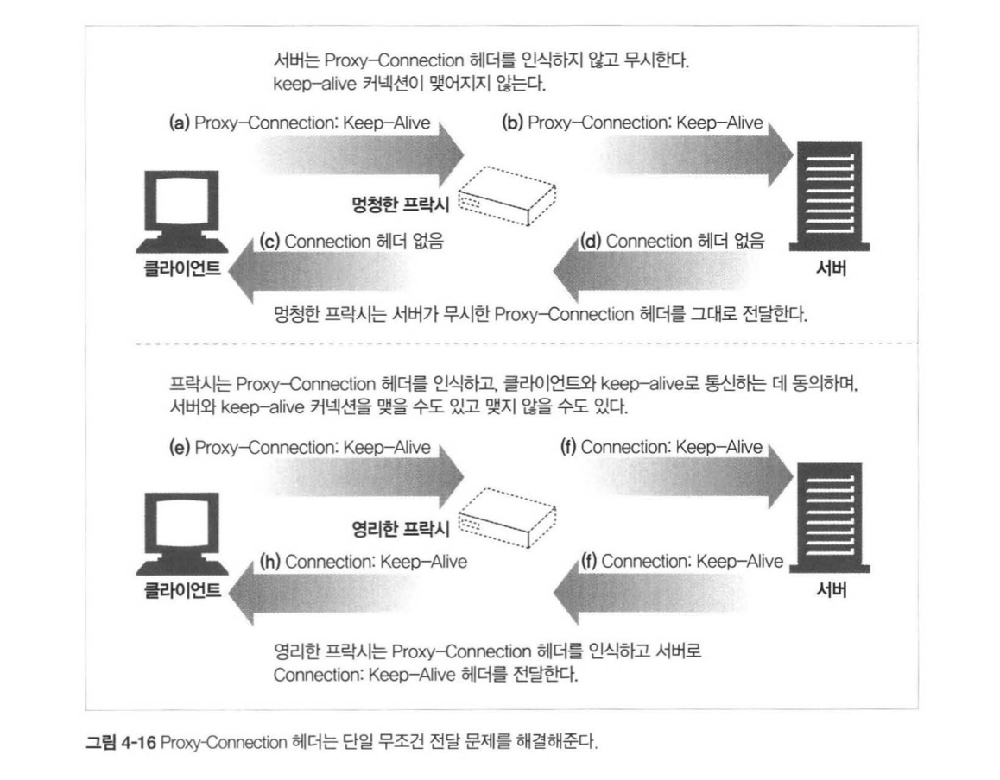

## HTTP 완벽 가이드

### :four: 장 커넥션 관리

#### TCP 커넥션

`HTTP`은 안타깝게도 아직까지는 TCP로 이루어져 있습니다 :cry:  

곧 HTTP 3.0 에서는 QUIC 을 바탕으로 한 UDP로 될 예정이니 얼른 ㅎㅎ 되는 날이 오길. 

그래서 HTTP를 TCP를 바탕으로 요청하는 과정은. 

1. 목적지의 IP : port 로 TCP 커넥션을 맺고
2. 목적지 서버로 **GET**을 하고 
3. 응답메세지를 읽고
4. 커넥션을 끊는다

TCP는 소켓을 기반으로 커넥션이 맺어지는데, 그거 아시는가?  

```
커넥션을 맺어주는 server측 bind port는 따로 있고, 실제 connection이 맺어지는 port는 다르다는 사실을..
```

또한 하나의 port의 여러 개의 connection이 존재할 수 있다는 사실. 

이는 왜냐하면..

```
TCP는 4-tuple을 기반으로 커넥션을 정의하기 때문이다.
4-tuple은 <목적지 IP> : <목적지 port> , <출발지 IP> : <출발지 port>
```

놀랍지 않은가?  

#### TCP 커넥션 성능 관리

TCP 성능이 많이 느려지는 이유는..

* TCP 커넥션의 핸드세이크 설정
  * 이 망할 3-way 헨드세이크가 :hand: 문제인 것이다..
  * SYN과 SYN-ACK를 위한 시간이 너무나 오래걸리는 것!
* 인터넷 혼잡을 피하기 위한 TCP의 slow start :turtle:
  * 정확히 말하자면 Congestion Control 때문이다. 
  * 패킷을 보낼 수 있는 양을 지수 단위로 늘리기 때문인 것이다
  * 다시 말하면, 1개의 packet 다음에는 window size가 2개, 4개, 8개.... 이렇게 늘어난다
* TCP의 ACK 확인을 위한 확인 응답 지연 알고리즘 :book:
  * 이거는 그냥 원래 그렇게 설계되었다.
  * 버퍼 Size에 해당하는 값이 도달되면 그때 한번에 모아서 전송하기 때문이다
* TIME_WAIT 지연과 포트 고갈 :alarm_clock:
  * 보통 2MSL을 기반으로 같은 커넥션이 2분 이내에 또 생성되는 것을 막는다
  * 이 경우는 서버가 초당 500개 이상의 트랜잭션을 처리하지 않는 이상 나올 수는 없는 문제다

#### HTTP 커넥션 관리

흔히 Connection Header는 keep-alive인 경우가 상당히 많은데,  

일차적인 맺고 끊음 이라면 `Connection: close` 라고 설정해도 좋다. 

흔히 웹페이지를 랜더링하는 요청을 시작하면, **imgae** 파일이 여러 개인 경우가 많은데,  

단순히 단일 커넥션으로 맺고 끊음만 한다면.. 벌써 핸드세이크가 .. 에바다... :cry:  

그래서 해결해보자~!  

* **병렬 커넥션**: 여러개의 HTTP 동시 요청
* **지속 커넥션**: TCP의 커넥션을 재활용하는 방법
* **파이프라인 커넥션**: 공유 TCP 커넥션을 통한 병렬 HTTP 요청
* **다중 커넥션**: 요청과 응답들에 대한 중재

#### 병렬 커넥션

병렬 커넥션의 경우 네트워크 밴드폭이 좁다면.. 꼭 항상 빠르지는 않더라. 

병렬 커넥션은 고객을 위한 성능 최적화 방식이다 ㅎㅎ  

사람들은 이미지라도 하나씩 뜨면 아예 안뜨는 것보다 빠르게 느끼기 때문 :smile:  

#### 지속 커넥션

병렬 커넥션의 단점들을 해결한 방법이다

* 트랜잭션 마다 커넥션을 맺고 끊기 때문에 **시간과 대역폭이 소모**되는 점
* 새로운 커넥션은 **TCP의 느린 시작** 때문에 느리다는 점
* 실제로 연결할 수 있는 병렬 커넥션은 제한이 있다는 점

그래서 이를 위해서 HTTP 에  여러 기능들이 추가되었다 ㅎㅎ. 

`HTTP 1.0` 에는 **keep-alive**가 있고, `HTTP 1.1` **지속 커넥션**이 있다~!  

<div>
  
</div>


지속 커넥션의 문제는 바로 `멍청한 프락시` 문제를 야기한다. 

Client <-> Proxy <-> Server 사이에 `Proxy` 가 **keep-alive** 헤더를 인식하지 못한다면. 

Server측에서 응답을 내려주는 과정에 Proxy는 커넥션이 끊어지기만은 기다릴 것이다. 

이럴 때 client측에서 다시 요청을 보낸다면, Proxy측에서는 아직 요청이 끝나지 않았기 때문에 가뿐히 client를 무시할 것이다. 

결국 **timeOut** 이 날 때까지 기다리게 된다..  

**따라서 Proxy는 Keep-alive 헤더를 받으면, 절대 Server한테 keep-alive를 유지한채로 패킷을 보내면 안된다**    

그래서 우리는 :bulb: 영리한 Proxy가 존재한다. 

이 친구는 `Proxy-Connection` 헤더를 바탕으로 스스로 알아서 지속 커넥션을 결정한다!!  

<div>
  
</div>


하지만 이것은 언제까지나 `HTTP 1.0` 의 명세임을 인식하라 ㅎㅎ. 

똑똑한 `HTTP 1.1` 은 **default로 항상 지속 커넥션**을 유지한다!!  

#### 파이프라인 커넥션

이 친구는 지속 커넥션에서 발전된 형태의 커넥션이다~!  

**지속 커넥션을 유지한 채로 트랜잭션에 대한 순위를 매겨서 파이프라이닝 하는 것이다~!**  


이 챕터 :bookmark: 는 정말 어렵다. 

개인적으로 이해하기 많이 어려운 부분도 있고, 직접 자료를 더 찾아봐야 하는 부분도 있더라..  

더 열심히 공부하자 ㅎㅎ 

