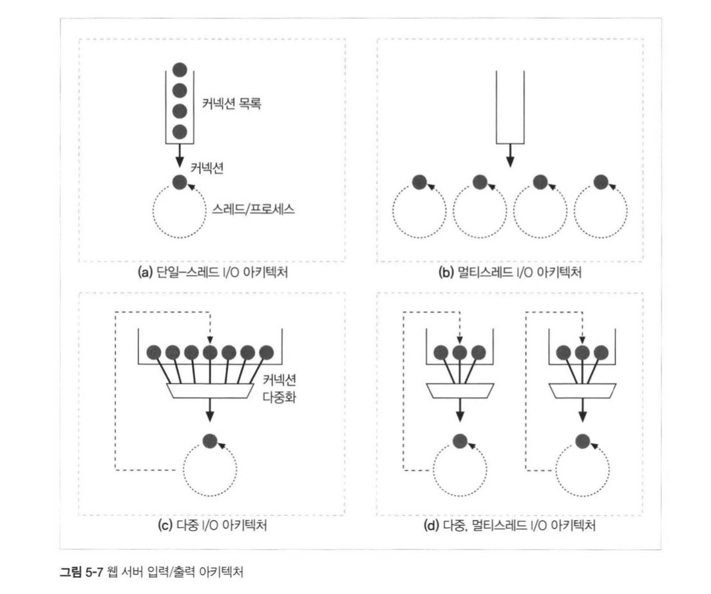

## HTTP 완벽 가이드

### :five: 장 웹 서버

#### 웹 서버가 하는 일

흔히 우리가 아는 웹 서버는 이렇게 동작한다

1. 커넥션을 맺는다
2. 응답을 받는다
3. 응답을 처리한다
4. 리소스에 접근한다
5. 응답을 만든다
6. 응답을 보낸다
7. 트랜잭션을 로그에 기록한다

여기서 응답 :love_letter: 을 처리하는 과정에는 다음과 같은 과정을 따른다~!

* 요청줄을 파싱하여, 메서드, 식별자(URI), 버젼 번호를 찾고
* 요청줄을 **캐리지 리턴 줄바꿈(CRLF) 문자열**로 끝나는 것을 찾는다
* 메세지 헤더들을 읽고 각 메세지 헤더는 CRLF로 끝난다
* 헤더의 끝을 의미하는 CRLF로 끝나는 줄을 찾으면
* 요청 본문을 Content-Length 만큼 읽는다!

#### 서버의 멀티쓰레드 지원 여부

  

크게 4가지 모델로 이루어져있는데

* 단일 쓰레드는 한 번에 하나의 요청만 처리하고
* 멀티쓰레드는 여러 개의 요청을 한번에 처리할 수 있고
* 다중 I/O는 모든 커넥션을 동시에 감시해서 커넥션을 조절할 수 있고
* 다중 멀티쓰레드 I/O는 하나의 쓰레드가 여러개의 커넥션을 조절하는 방식이다

응답을 만들고 보내는 과정은 이미 지금까지 진행온 챕터 :book: 에서 다 참고받을 수 있다 ㅎㅎ

5장은 여기까지로 하고, 중요한 `6장 Proxy`에 대해서 더 정리해보자 :smile:

