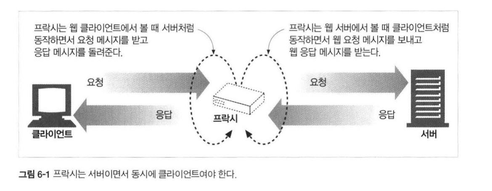
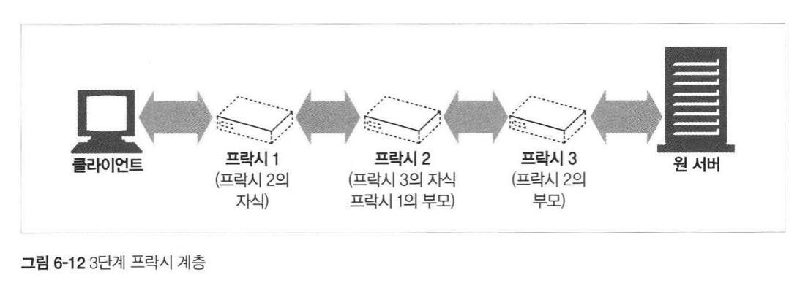
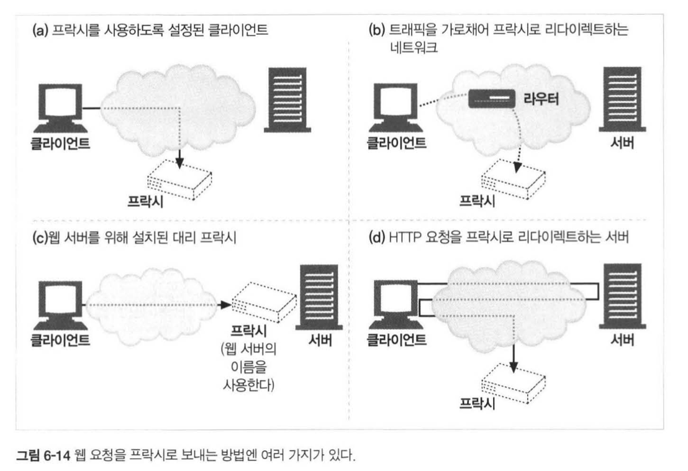
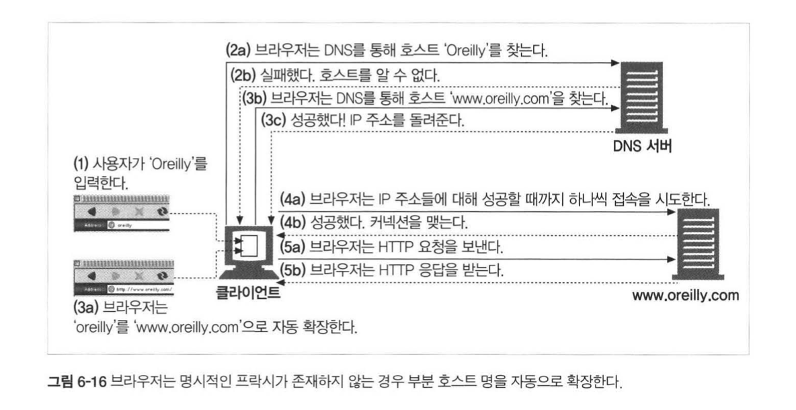
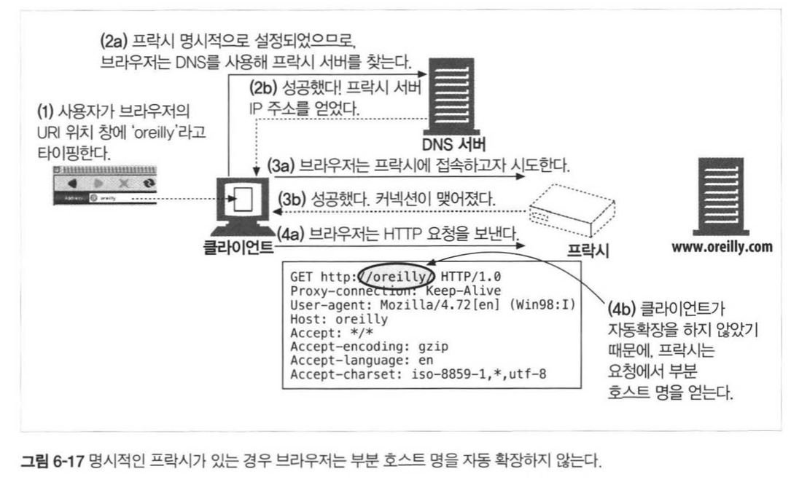

## HTTP 완벽가이드

### :six: 장 Proxy

<div>
  
</div>


#### Proxy vs Gateway

`Proxy` 는 **같은 프로토콜** :phone: 을 사용하는 둘 이상의 애플리케이션을 연결하고,  

Gateway 는 **서로 다른 프로토콜**을 사용하는 둘 이상을 연결한다. 

Gateway는 서로 다른 프로토콜로 이야기를 하더라도 서로간의 트랜잭션을 완료하게 된다~!  

#### Proxy를 사용하는 이유?

* 어린이 필터
* 문서 접근 제어자: 웹 리소스에 대한 접근 제어를 각각 가지는게 아니라, **중앙 집권**하기 위해 사용
* 보안 방화벽
* 웹 캐시: 인기 있는 로컬 사본을 관리하고, 해당 문서에 대한 요청이 오면 빠르게 제공
* 대리 프락시
* 콘텐츠 라우터
* 트랜스코더
* 익명화 프락시


#### 프락시 서버 배치

보통의 Proxy가 배치되는 경우는 여러 개가 있는데,  

* 출구(Engress) Proxy: 외부로 통하는 인터페이스를 통로로 지정하는 것
* 접근(입구) Proxy: 일종의 Cache Proxy와 비슷한 개념
* 대리 Proxy: 일종의 리버스 Proxy인데, 웹 서버들의 끝에서 바로 앞에 위치해서 중개자 역할을 시도
* 네트워크 교환 Proxy

<div>
  
</div>


경우에 따라서는 Proxy는 여러 부모들을 가질 수 있다. 

그림은 이렇게 되어 있지만, Proxy는 상황에 맞게 알맞은 부모를 선택할 수 있다. 

* 부하 균형
* 지리직 인접성
* 프로토콜 / 타입 라우팅
* 유료 서비스 가입자를 위한 라우팅

#### Proxy가 트래픽을 처리하는 다양한 방법

<div>
  
</div>


#### 프락시 요청의 미묘한 특징들

* Proxy의 URI는 서버 URI와 다르다
* 명시적인 Proxy는 완전한 URI를 가지고 있지만, 그렇지 않다면 부분 URI만 사용한다
* 인터셉트 프락시는 부분 URI만 받는다.!!

프락시는 프락시 요청과 서버 요청을 둘 다 받을 수 있는데,  

1. 완전한 URI = 그냥 처리
2. 부분 URI + `Host` 헤더 = 원 서버의 이름과 Port를 알아내야 한다
3. 부분 URI = 원 서버를 알아내야 한다
   1. 인터셉터 프락시가 가로챈 경우면 IP 주소와 포트를 알아낼 수 있다
   2. 프락시가 원래 서버를 대신하는 리버스 프락시면 이미 설정되어 있어서 알 수 있다
   3. 위 경우에 해당하지 않으면 client에게 host 헤더를 명시하는 요청으로 해달라고 해야한다

다음은 URI가 명시되지 않은 경우에 해당하는 **전체적인 Flow**를 나타낸다.!  

* **URI Resolution ( 프락시 없는 URI 분석 )**

<div>
  
</div>


* **명시적인 프락시를 사용할 때 URI 분석**

<div>
  
</div>


#### 메세지 추적

오늘날에는 Proxy :electric_plug: 들을 한 두개 이상씩 지나가는 것은 정말 일도 아니다. 

그렇기 때문에 메세지의 흐름을 추적하는 방식이 필요해졌는데. 

이를 지원하는 것이 바로 `Via` 헤더다. 

뭐 대충 예를 들자면 이런식이다~!  

```text
Via: 1.1 proxy-62.irenes-isp.net, 1.0 cache.joes-hardware.com
```

Via 헤더를 통해서 어느 지점(**홉**) 을 통과했는지 기록하면서 진행하게 된다~!  


