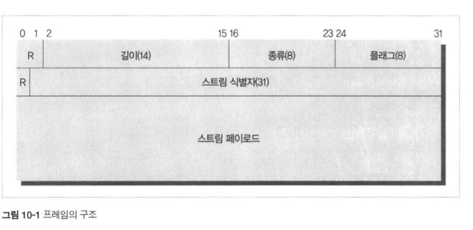

## HTTP 완벽가이드

## 1️⃣0️⃣ 장 HTTP/2.0

### 등장배경
커넥션 하나를 통해 요청을 하나 보내고, 그에 대한 응답 하나만을 받는 메세지 교환은 정말 단순하지만  
응답이 올 때까지 기다려야 한다는 **지연(latency)** 을 피할 수 없었다  
이 문제를 해결하기 위해 파이프라인 커넥션이 존재하지만, 근본적인 성능 개선이 되지 않았다  
그래서 구글이 `SPDY` 라는 프로토콜을 내놓았는데,  
1. **헤더를 압축하여 대역폭을 절약** 하고
2. 하나의 TCP 커넥션에 **여러 요청을 동시** 에 보낼 수 있으며
3. 클라이언트가 요청을 보내지 않아도 **서버가 능동적으로 자원을 푸시** 할 수 있다

실제로 RTT(Round Trip Time)이 줄어드는 효과가 있었으며,  
위를 바탕으로 `HTTP/2.0` 이 나오게 되었다

### 개요
한 개의 `스트림` 에서 한쌍의 요청과 응답을 처리한다  
또한 한 개의 커넥션에서 여러개의 `스트림` 을 만들 수 있으므로 동시 처리가 가능하다  
이들 `스트림` 에 대해서 흐름 제어와 우선순위 부여 기능도 제공한다  

### HTTP/1.1 주요한 차이점

#### 프레임

    

HTTP/2.0 에서는 모든 메세지가 프레임으로 담겨 전송되며,  
8byte 크기의 헤더와, 최대 16838byte 크기의 페이로드로 구성되어 있다  

#### 스트림과 멀티플렉싱

또한 모든 `스트림` 은 31bit의 unsigned int로 된 고유한 식별자를 갖습니다  
`스트림` 은 협상없이 생기기 때문에 협상 과정에 대한 TCP 패킷을 주고받을 필요가 없습니다  

#### 헤더 압축

사실 HTTP의 헤더들을 되게 데이터를 반복적으로 사용하고,  
중복되는 헤더가 정말 많기 때문에 압축을 하면 성능상의 이점이 많다  
그래서 이를 `허프만 알고리즘` 을 사용해서 헤더를 압축하게 된다!  
만일 압축을 풀 수 없는 상황이라면, **COMPRESSION_ERROR** 와 함께 끊어야 한다  

#### 서버 푸시

HTTP/2.0은 클라이언트의 하나의 요청에 대해서 응답으로 **여러 개의 리소스** 를 보낼 수 있다  
그래서 응답을 여러 개로 보내기 위해 푸시 방식을 사용하게 된다!  

### 알려진 보안 이슈

크게 2가지가 있는데요  
1. 중개자 캡슐화 공격
2. 긴 커넥션 유지로 인한 개인정보 유출 우려

**중개자(Proxy)** 가 HTTP/2.0 메세지를 HTTP/1.0 메세지로 변환할 때  
메세지의 의미가 변질될 가능성이 있다는 것인데요  
HTTP/2.0의 메세지는 바이너리로 인코딩 되어있기 때문입니다  
 
**개인정보 유출 우려**는 브라우저가 사용자에 대해서 이전에 무엇을 했는지  
긴 커넥션을 뜯어봄으로 통해 알아낼 수 있기 때문입니다    
