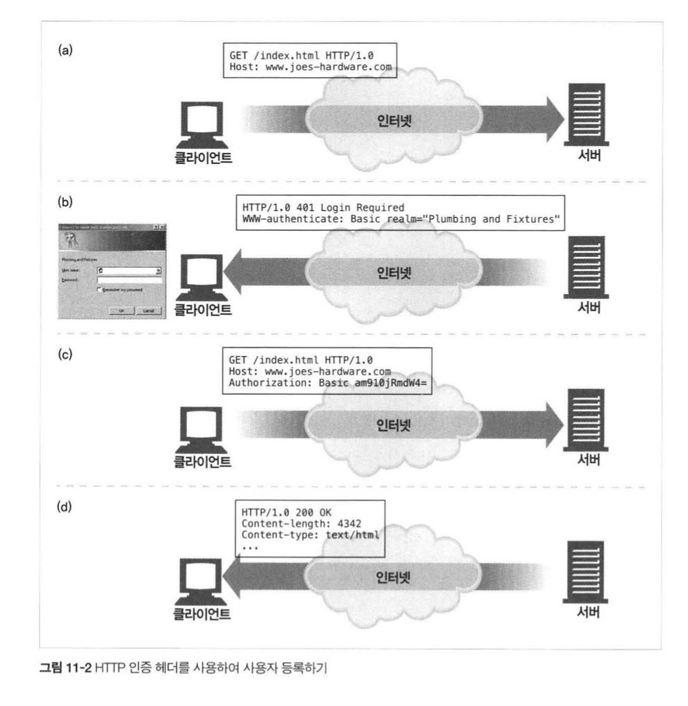
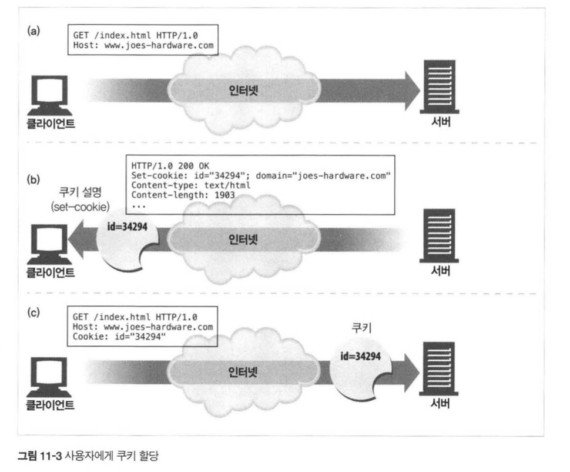
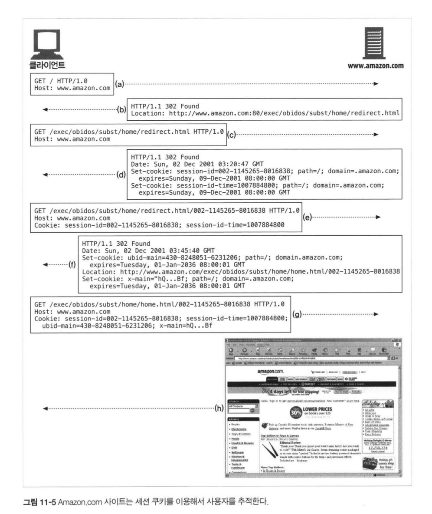

## HTTP 완벽가이드

### :one::one: 장 클라이언트 식별과 쿠키

서버입장에서 클라이언트 :customs: 를 알기 위해서는 어떻게 해야 할까.?  

정답은 바로.. Header에 있다.!  

* From: 사용자의 이메일 주소
* User-Agent: 사용자의 브라우저
* Referer: 사용자가 현재 링크를 타고 온 근원 페이지
* Authorization: 사용자의 이름과 비밀번호
* Client-ip: 클라이언트 IP 주소
* X-Forwarded-For: 클라이언트의 IP 주소
* Cookie: 서버가 생성한 ID Label

기본은 요렇게 있고, 어떻게 다루는지 심하게 한번 알아보자 :smile:   

#### 사용자 인증 과정

<div>
  
</div>


전체적인 Flow는  

서버 입장에서 `WWW-authenticate` 헤더를 이용해서 인증하라고 요청해주는 모습이고,  

클라이언트는 `Authorization` 헤더를 이용해서 사용자에 대한 인증이 이루어지는 모습이다.!    

문제는 이렇게 되면, **사용자 입장에서 웹 사이트를 옮겨 다니면 매번 인증해야 되는 아주 귀찮은 일**이 되버린다. 

어떻게 하면 조금 더 쉽게 할 수 있을까?  

#### 쿠키

크게 2가지 종류가 있다

* **세션 쿠키(session cookie)**: 사용자가 사이트를 탐색할 때, 관련한 설정을 저장하는 임시 쿠키, 브라우저를 닫으면 삭제됨
* **지속 쿠키(persistent cookie)**: 지속 쿠키는 세션과는 다르게, 컴퓨터를 재시작해도 유지함

<div>
  
</div>


쿠키는 일종의 클라이언트를 상태를 관리하는 것.!!  

브라우저는 수천 수백개의 쿠키를 가질 수 있지만, 브라우저가 쿠키 전부를 모든 사이트에 보내지는 않는다. 

보통 2~3개의 쿠키만 보내는데,

* 쿠키를 모두 전달하면 성능이 저하
* 쿠키는 대부분 key/value로 저장되어 있기 때문에, 대부분 사이트에서는 인식하지 않는 무의미한 값
* 잠재적인 개인정보 문제를 야기

보통 그래서 쿠키는 서버에서 생성할 때

```text
Set-Cookie: user="mary"; domain="yahoo.com"
```

이런식으로 특정 도메인(사이트)를 명시해준다.!  

#### Set-Cookie :cookie: 헤더

그렇다면 `Set-Cookie` 헤더의 속성에는 무엇이 있을까?  

| Set-Cookie 속성 | 설명과 사용방법                                              |
| --------------- | ------------------------------------------------------------ |
| Expires         | (선택 속성) 쿠키의 생명주기를 나타내는 날짜 문자열을 기술한다. [ 요일, DD-MM-YY, HH:MM:SS GMT ] |
| Domain          | (선택 속성) 이 속성에 기술된 도메인을 사용하는 서버 호스트명만 쿠키를 전송한다 [ .com .edu .net .org .mil ... ] 도메인이 명시되지 않아있다면, 서버의 호스트명을 Default로 사용 |
| Path            | (선택 속성) 서버에 있는 특정 경로에만 쿠키를 할당            |
| Secure          | (선택 속성) 이 속성이 포함되어 있으면 HTTPS 연결을 사용할 때만 쿠키를 전송 |

앗 :loudspeaker: 하지만 더 업그레이드된 `Set-Cookie2` 속성도 있다. 

| Set-Cookie2 | 설명과 사용방법                                              |
| ----------- | ------------------------------------------------------------ |
| Version     | (**필수 속성**) 쿠키 명세의 버젼을 가리키는 정수값이다 [ Version="1"; ] |
| Comment     | (선택 속성) 서버가 쿠키를 사용하려는 의도를 기술한다         |
| CommentURL  | (선택 속성) 서버가 쿠키를 사용하려는 목적과 정책에 대해 기술된 웹페이지 링크 |
| Discard     | (선택 속성) 클라이언트 프로그램이 종료될 때 쿠키를 삭제하라는 헤더 |
| Domain      | 위와 동일                                                    |
| Max-Age     | (선택 속성) Expires와 목적은 유사하나, 실제 쿠키의 생명주기를 초 단위로 산정한 정수값 |
| Path        | 위와 동일                                                    |
| Port        | (선택 속성) 특정 Port에 해당하는 서버로만 쿠키를 전달        |
| Secure      | 위와 동일                                                    |

#### 세션 쿠키의 예시

<div>
  
</div>


#### 쿠키 :cookie: 의 캐싱 전략

기본적인 원칙들은

* 캐시되지 말아야 할 문서가 있다면 표시하라 (Feat. `Cache-Control: no-cache`)
* Set-Cookie 헤더를 캐시하는 것에 유의하라
* Cookie 헤더를 가지고 있는 요청을 주의하라


