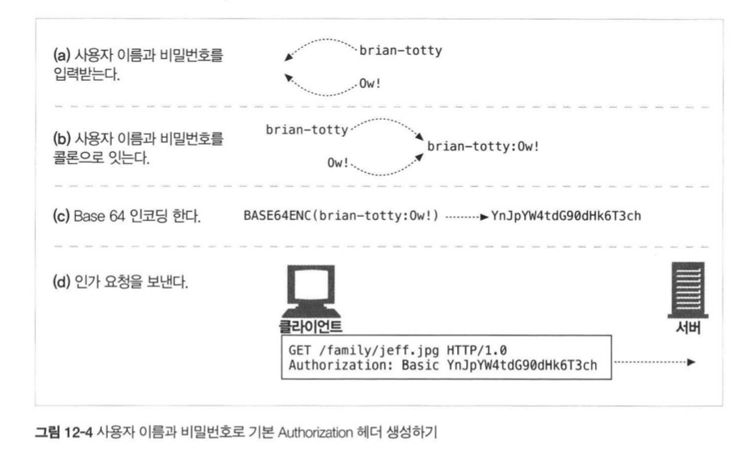

## HTTP 완벽가이드

### :one::two: 장 기본 인증

우리는 쿠키 :cookie: 를 통해 서버가 어떻게 사용자를 기억하는지 알게 되었는데,  

이번에는 어떻게 인증이 이루어지는지 한번 알아보도록 해요~!  

먼저 클라이언트가 서버에게 내 자신이 어떤 사람인지 알려줘야 한다~!  

그래서 헤더에 이런 정보를 포함해보자   

| 단계      | 헤더                  | 설명                                                         | 메서드/상태      |
| :-------- | --------------------- | ------------------------------------------------------------ | ---------------- |
| 요청      |                       | X                                                            | GET              |
| 인증 요구 | `WWW-Authenticate`    | 서버는 사용자에게 사용자 이름과 비밀번호를 제시하라는 의미로 `401` status code와 설명을 작성한다. 다만 Proxy 서버의 경우 407을 응답한다. 예시: `WWW-Authenticate: Basic ?` | 401 Unauthorized |
| 인증      | `Authorization`       | 클라이언트는 인증 요청을 다시 보내는데, 인증 알고리즘과 사용자 이름과 비밀번호를 헤더에 같이 넣어서 전송한다. 예시: `Authorization: Basic ?` | GET              |
| 성공      | `Authentication-Info` | 인증 정보가 정확하면 서버는 응답한다. 위 헤더는 선택적인 헤더로 인증 세션에 관한 추가 정보를 기입한다 | 200 OK           |

#### 요청의 상세방법

  

#### 기본 인증의 보안 결함

위와 같은 인증은 편리하지만, 안심할 수는 없다. 

누군가 패킷을 가로채서 Base64 Decoding을 실시한다면.? -> *바로 개인정보 유출이다*. 

그래서..  

1. HTTP 트랜잭션을 SSL 암호화 채널을 통해 보내거나, 보안이 더 강화된 **다이제스트 인증 프로토콜**을 사용하자
2. 기본 인증은 재전송 공격을 예방하기 위한 어떤일도 하지 않는다.
3. 만일, 기본 인증을 요구하는 서버가 가짜 서버라면? -> 큰일난다 정말..

그래서 꼭 SSL(Secure Socket Layer)와 같이 꼭 사용하자. 

