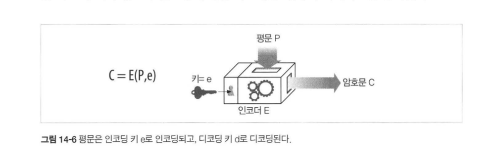
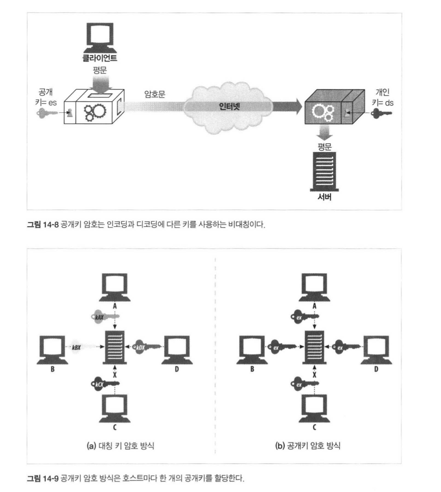
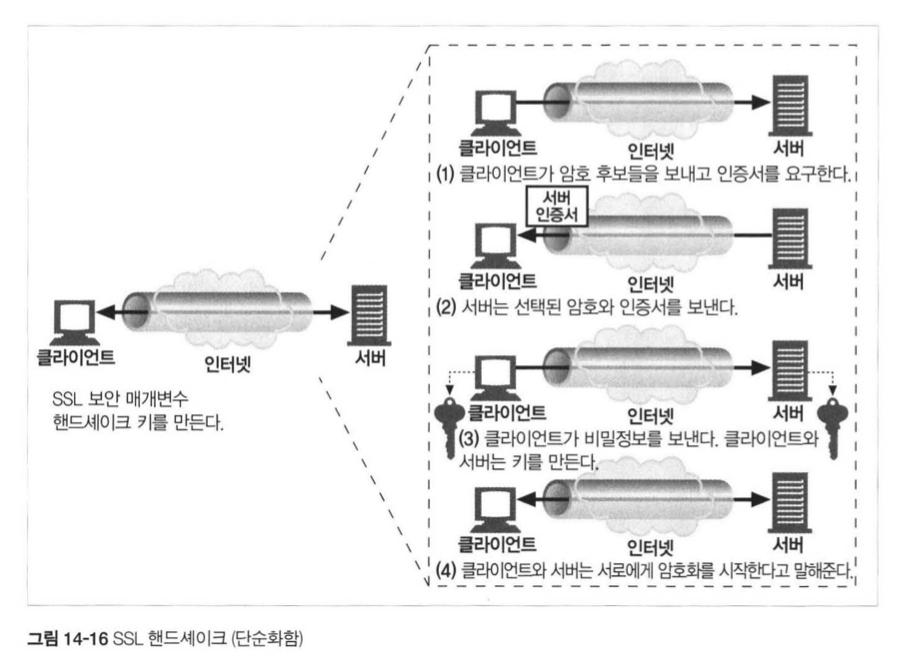

## HTTP 완벽가이드

### :one::four: 장 보안 HTTP

쉽게 말해서는 `HTTPS` 를 가르킨다~!  

`HTTPS` 는 HTTP Protocol을 **SSL(Secure Socket Layer)를 태워서 보내는 것**이다~!  

어떻게 이루어지는지 용어부터 천천히 알아보자~!  

#### 디지털 암호학

용어 정리

* 암호: 텍스트를 아무나 읽지 못하게 인코딩하는 알고리즘
* 키: 암호의 동작을 변경하는 숫자로 된 매개변수
* 대칭키: 인코딩과 디코딩을 같은 키로 사용하는 알고리즘
* 비대칭키: 인코딩과 디코딩에 서로 다른 키를 사용하는 알고리즘
* 디지털 서명: 메세지가 위조되었는지 안되었는지 않았음을 증명하는 체크섬
* 디지털 인증서: 신뢰할만한 조직에 의해 서명되고 검증된 신원 확인 정보

키가 있는 암호방식은 다음과 같이 암호화 된다. 

  

인코딩 키와 디코딩 키가 동일한 방식이 `대칭키` 방식:key: 이며,  

잘 알려진 알고리즘으로는 **DES**, **Triple-DES**, **RC2**, **RC4** 등이 있다. 

다만 `대칭키` 가 누설된다면, 쉽게 복호화된다는 단점이 있다 ㅠ. 

#### 공개키 암호법

인코딩 키와 디코딩 키를 다르게 가져가는 방식을 `비대칭키` 방식:key: 이며,  

하나는 Client에게, 하나는 Server가 가지고 있으므로, 서로 암호화된 통신이 가능하게 한다~!  

그러므로 여러 **Client는 하나의 공개키로만 통신**이 가능하다.!(어차피 서버만 풀 수 있으므로)  

  

RSA 알고리즘으로 암호화하고, 복호화하기 때문에 절대 뚫을 수 없다는 장점이 있지만,  

그렇기 때문에 느리다는 단점이 있다. 

그래서 보통은 비대칭키 방식과 대칭키 방식을 섞어서 사용한다.!  

#### 디지털 인증서

디지털 인증서:page_with_curl: 는 공식적으로 인증된 `인증 기관` 에 의해 서명된 정보의 집합이다. 

내포하는 있는 내용으로는

* 대상의 이름(조직, 서버)
* 유효 기간
* 인증서 발급자(누가 이것을 보증하는가)
* 인증서 발급자의 디지털 서명

그래서 `HTTPS` 로 통신하기 위해서는 Client에서 먼저 접속한 서버에서 인증서를 가져옵니다~!  

해당 인증서에는

* 웹 사이트 이름과 호스트명
* 웹 사이트의 공개키
* 서명 기관의 이름
* 서명 기관의 서명

Client에서 인증서를 받으면, **인증 서버(Certificate Authority)로부터 서명 기관을 검사**합니다. 

이 인증서의 서명 기관을 Client가 알고 있다면, **해당 공개키로부터 서명을 검증**할 수 있게 되는거죠. 

그래서 웹 사이트의 공캐키로 전송하고자 하는 내용을 암호화해서. 

서버로 전송하게 되면, **서버는 자신이 갖고 있는 비대칭키로 복호**화하게 됩니다.!

#### HTTPS

HTTP에서 SSL을 타는 방식으로, 기본 Port 번호는 `443` 입니다.

HTTP에서 핸드세이크 과정을 거칠때, **SSL 핸드세이크**라는 특별한 과정이 추가로 생기는데..   

  

그래서 보안 트랜잭션을 처리할 수 있게 되는 것이다. 

서버에서 보낸 `서버 인증서`에는 아래와 같은 정보들이 포함되어 있다. 

| 인증서 항목           | 예시                   |
| --------------------- | ---------------------- |
| 인증서 일련변호       | 35:DE:F4:CF            |
| 인증서 유효기간       | 2020년 9월 10일 수요일 |
| 사이트의 조직 이름    | 죠의 하드웨어 온라인   |
| 사이트의 DNS 호스트명 | www.joes-hardware.com  |
| 사이트의 공개키       | (Key)                  |
| 인증서 발급자 이름    | RSA 데이터 보안        |
| 인증서 발급자 서명    | (Signature)            |

SSL은 되게 복잡한 바이너리 프로토콜이라서, 직접 구현하려면 공용화된 라이브러리를 추천한다. 

대표적으로 `OpenSSL` 이 존재한다. 

