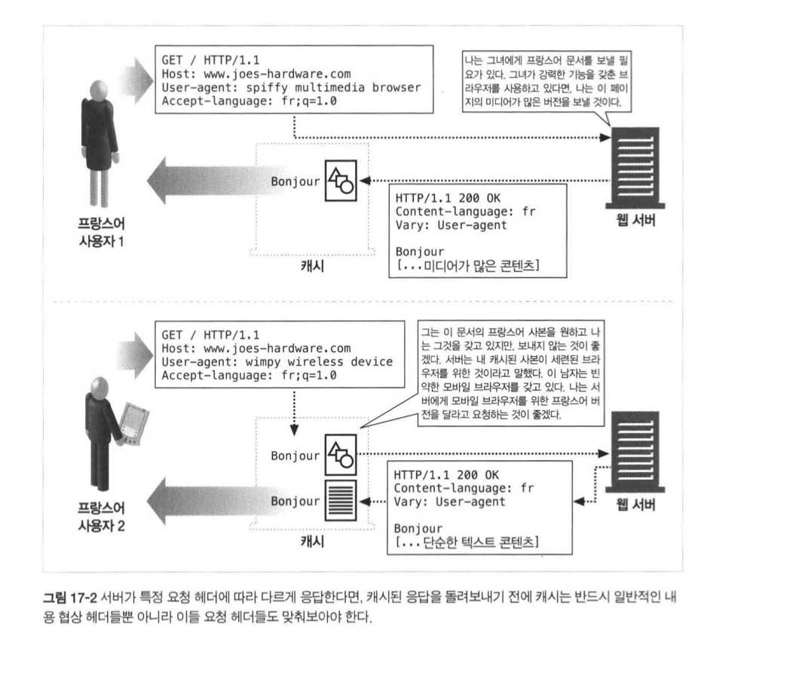
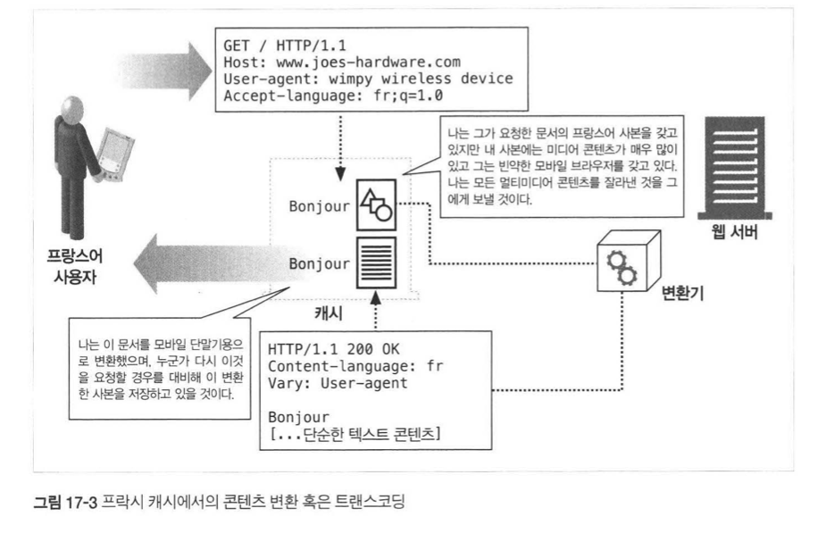

## HTTP 완벽가이드

### :one::four: 장 협상과 트랜스코딩

웹 어플리케이션이 어떻게 서로 `협상` 할까? :handshake:   

#### 클라이언트 주도 협상

서버에게 있어서 가장 쉬운 협상은 서버가 클라이언트의 요청을 받았을 때,  

가능한 페이지의 목록을 응답으로 돌려주어 클라이언트가 보고 싶은 것을 선택하게 하는 것이다. 

하지만 이 방법은 단점이 명확하다.  

하나의 URL 에 대해서 여러개의 조건별 페이지가 존재한다면?

> 뭘 내려줘야 할지 모르겠더라

#### 서버 주도 협상

그래서 서버가 현명한 결정을 할 수 있게 `Accept` 헤더를 활용하는 것이다. 

내용 협상을 위한 헤더로는 다음과 같은 것이 있다. 

| 헤더            | 설명                                                 |
| --------------- | ---------------------------------------------------- |
| Accept          | 서버가 어떠한 미디어 타입으로 보내도 되는지 알려준다 |
| Accept-Language | 어떠한 언어로 보내도 되는지 알려준다                 |
| Accept-Charset  | 어떠한 차셋으로 보내도 되는지 알려준다               |
| Accept-Encoding | 어떠한 인코딩으로 보내도 되는지 알려준다             |

그렇다면, `Accept` 헤더에는 꼭 하나의 타입만 명시해야 되는가?  

그건 아니다. 우리에게는 **품질값(quality value, 줄여서 q값)** 을 이용해 전달할 수 있다. 

```http
Accept-Language: en;q=0.5, fr;q=0.0, nl;q=1.0, tr;q=0.0
```

 #### 투명 협상

투명 협상은 **클라이언트 입장에서 협상하는 중개자 프락시** 를 둠으로써. 

클라이언트와 메세지 교환을 최소화하는 동시에 서버 주도 협상으로 인한 부하를 줄이는 방법이다. 

이를 도와주는 것이 바로 `Vary` Header 이다. 

```text
서버는 응답에 Vary 헤더를 포함시켜 중개자에게 내용 협상을 위해 어떤 헤더를 사용하고 있는지 알려준다
```

<div>
  
</div>

쉽게 말해서는 `Vary` 헤더에 따라 콘텐츠의 내용이 어떻게 전달되는지 결정되는 것이다

#### 트랜스코딩

서버가 클라이언트의 요구에 맞지 않는 문서를 가지고 있다면, 적절히 변환하는 것이 바로 트랜스코딩이다. 

그래서 트랜스코딩에는

* 포맷 변환: 한 포맷에서 다른 포맷으로 변환하는 작업
* 정보 합성: 문서에서 정보의 요점을 추출하는 것
* 내용 주입: 웹 문서의 양을 늘리는 방법(ex) 광고)

하지만 클라이언트의 매 요청마다 **트랜스코딩** 을 하는 것은 너무나 성능이 떨어진다. 

그러니까 우리는 `cache` 를 적절히 활용해서, 미리 변환해 놓은 것을 저장하는 방법도 있으니 적절히 섞어야 한다. 

<div>
  
</div>

