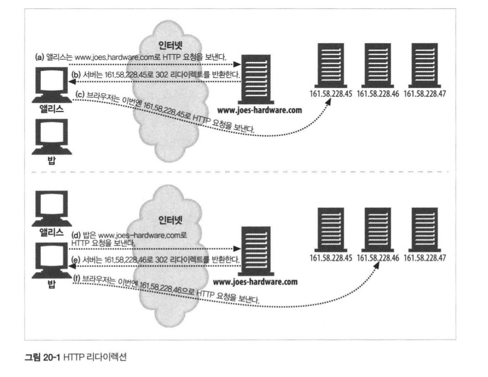
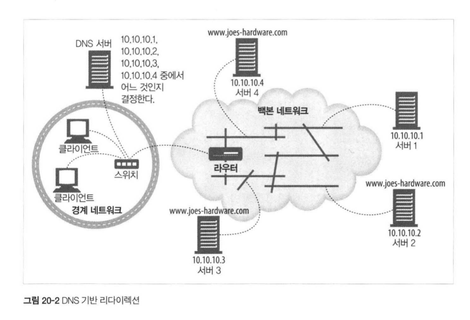
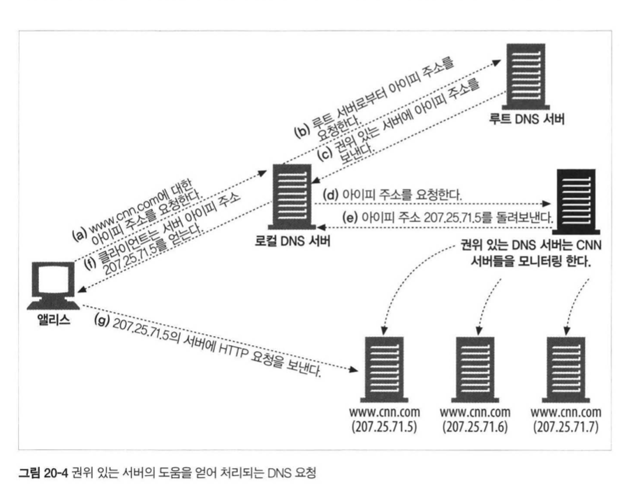

## HTTP 완벽가이드

### :two::zero: 장 리다이렉션과 부하균형

HTTP 는 혼자가 아닌 친구 :man: 들이 많다. 

#### 왜 리다이렉트인가?

현대 애플리케이션은 아래 3가지를 원하기 때문이다

* 신뢰할 수 있는 HTTP 트랜잭션의 수행
* 지연 최소화
* 네트워크 대역폭 절약

이러한 이유 때문에 웹 콘텐츠들은 여러 장소에 배포된다. 

그래서 적절하게 리다이렉션 :arrow_double_down: 할줄 알아야 한다!  

#### 리다이렉트 프로토콜

각각의 Layer마다 리다이렉트 하는 방식이 정말 다르다

| 매커니즘       | 어떻게?                                                      |
| -------------- | ------------------------------------------------------------ |
| HTTP           | 첫 번째 웹서버에게 요청이 가면 다른 서버의 주소를 알려줘서 리다이렉트한다. 라운드 로빈 방식 |
| DNS            | DNS 서버가 호스트 명에 대한 응답으로 어떤 IP 주소를 사용할지 알려준다. 라운드 로빈 방식 |
| IP MAC 포워딩  | 스위치나 라우터가 패킷의 목적지 주소를 읽을 때 리다이렉트 되어야 한다면, 프락시 목적지 MAC 주소를 준다. QOS |
| IP 주소 포워딩 | 위와 똑같은데 MAC 주소가 아닌 IP 주소를 준다                 |

#### 일반적인 리다이렉션

클라이언트가 서버에게 요청을 보냈을 때, 다른 곳에 요청을 보내주라는 리다이렉션 정보가 포함된 Response를 내려준다

```http
HTTP/1.0 302 Redirect
Server: Stronghold/2.4.2 Apache/1.3.6
Location: http://168.58.228.45/hammers.html
```

<div>
  
</div>

하지만 위 방식은 문제가 조금 있는데,

* 어떤 서버로 리다이렉트할지 결정할려면, 원 서버는 상당히 많은 처리를 해야한다
* 페이지에 접근할 때마다 클라이언트는 2번의 접근이 필요하다
* 리다이렉트 서버가 고장나면, 사이트도 고장난다

그래서 다른 기법과 같이 혼용되어 사용된다. 

그래서 이것이 바로 **DNS 리다이렉션** 방식이다

<div>
  
</div>

DNS 리다이렉션 방식은 여러가지가 존재하는데,

* 라운드 로빈: 쉽게 말해서 그냥 돌아가면서 배정하는 것이다
* 부하 균형 알고리즘: 웹 서버의 부하를 추적하고, 가장 적은 서버에게 보낸다
* 근접 라우팅 알고리즘: 근처의 웹 서버로 보내는 방식
* 결함 마스킹 알고리즘: DNS서버는 서비스 서버의 상태를 모니터링한다

그럼 서버 상태를 추적하려면 어떻게 해야할까?  

<div>
  
</div>

권위 있는 서버가 모니터링해서 어떻게 리다이렉트 할 것인지 결정하게 된다!  

#### 프락시/캐시 리다이렉션

사실 이 뒤로부터는 네트워크 관리자 혹은 개발자 분들이 보셔야 할 내용이다. 

deep 하게 공부하는 것은 의미가 있으나, 필요할 때 찾아보는게 좋을 것 같아요 :smile:  

( 개인적으로 Too Much 라 생각하여 이후의 챕터는 정리하는 건 생략합니다 )

