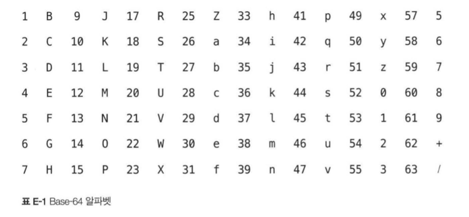
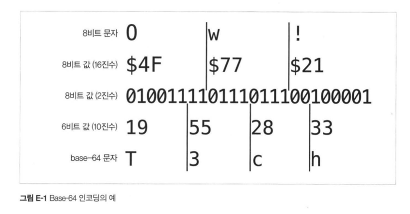

## HTTP 완벽가이드

### Base64 Encoding 🔑
가장 기본적인 인코딩 방식을 배워보자  

#### Base64는 인코딩 이진 데이터를 안전하게 만든다
임의의 바이트들의 연속을, 더 길지만 헤더 필드 값으로 사용할 수 있는  
일반적인 문자들만으로 이루어진 문자열로 반환한다  

#### 8비트를 6비트로

`base64` 인코딩은 8비트 바이트들의 연속을 받아서,  
6비트의 연속된 조각으로 쪼갠 뒤  
각 6비트 조각을 `base64` 알파벳으로 이루어진 64개의 글자들 중 하나로 할당한다  

    

6비트의 정보를 표현하기 위해 8비트 문자를 사용하기 때문에,  
인코딩된 문자열은 원래 값보다 `33%` 커진다  
 
다음은 실제 변환 과정의 예시이다  

    

#### Base64 패딩

8비트를 받아서 6비트의 형태로 전환하는 과정인데,  
만일 32비트의 문자열이 있다면?  
24비트는 정상적으로 `base64` 문자열로 바꾸지만,  
남은 8비트는 바꾸기가 힘드므로, 최소공배수인 `24` 비트단위로 무조건 쪼갠다  
그 뒤에 나머지를 **0비트로 채우게 된다**  
그리고, 만일 6비트로 쪼갰을 때, 남은 비트 그룹 전부 0으로 채워진 그룹이 있다면  
65번째 문자열인 `=` 로 채우게 된다.!  

    

